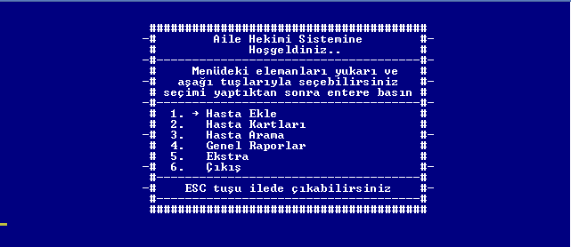
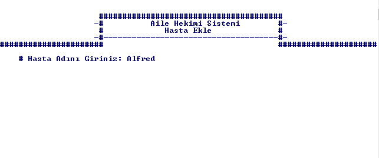
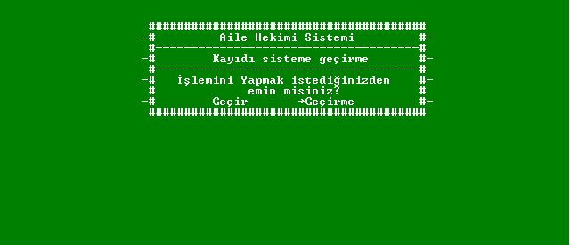
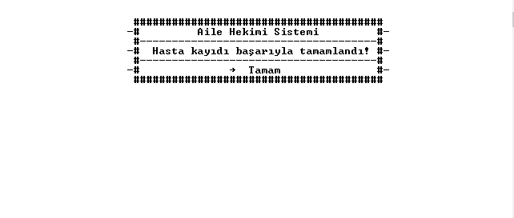
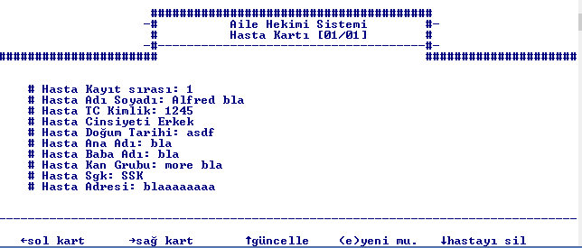

C File System Example (cfse)
======================

This project is old. Idea is old. It created for dealing file system with c. Pretty much short. I think it might help some people for understanding the dos screens and file system of dos so for that reason i created this repository.

Idea
--------------
Idea is creating doctor - patient watching system. Simply you can add new patients, find them etc. 
Also i was start to develop report system but it wasn't necessary so i stopped the development.

Compile'n Run
--------------------

Simply call lovely command
	make

	
Screenshots
------------------

